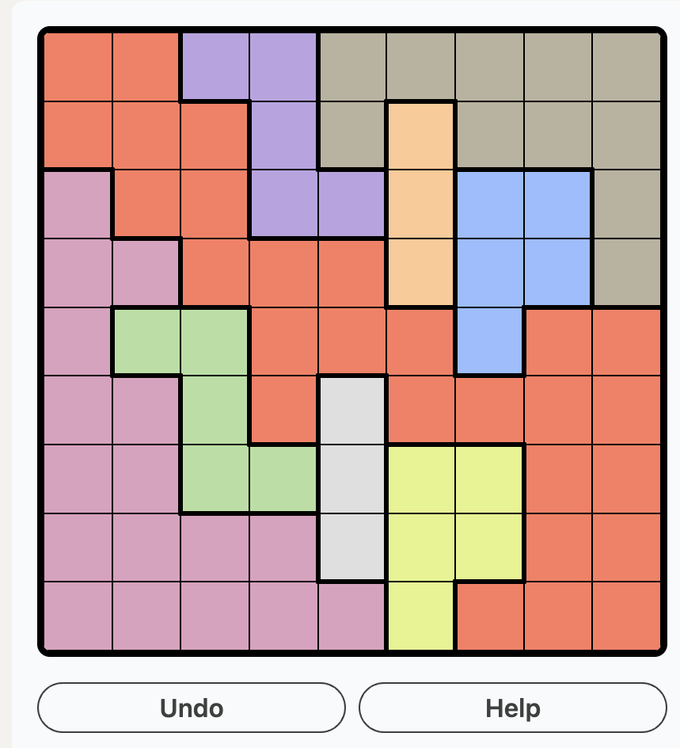
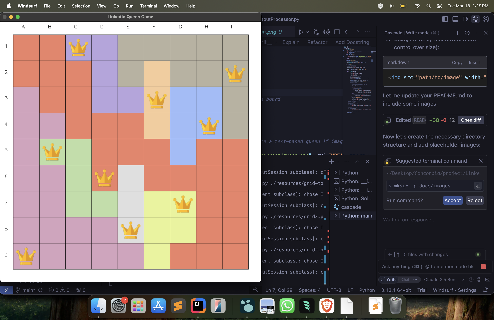

# LinkedInQueenGame
To solve LinkedIn Queen Problem using Computer Vision and Algorithms

## Problem Description
The LinkedIn Queen Game is a puzzle where you need to place queens on a colored grid such that:
1. Each color must have exactly one queen
2. No queen can attack another queen in all adjacent cells (horizontally, vertically) and just immediate adjacent cells in all four diagonals



## Solution Visualization
Here's how our solution looks:



## Prerequisites
- Python 3.8 or higher
- OpenCV
- Numpy
- Scikit-learn

## Installation
```bash
pip install -r requirements.txt
```

## Usage
1. Take a screenshot of the LinkedIn Queen Game puzzle
2. Run the solver:
```bash
python main.py path/to/screenshot.png
```

## Project Structure
```
LinkedInQueenGame/
├── com/
│   └── linkedIn/
│       └── solver/
│           ├── Grid.py
│           ├── InputProcessor.py
│           ├── OutputProcessor.py
│           └── Solver.py
├── setup.py
└── README.md
└── resources/
    ├── grid-today.png
    └── solution-today.png
    └── queen.png
    └── grid2.png
    └── solution-grid2.png
